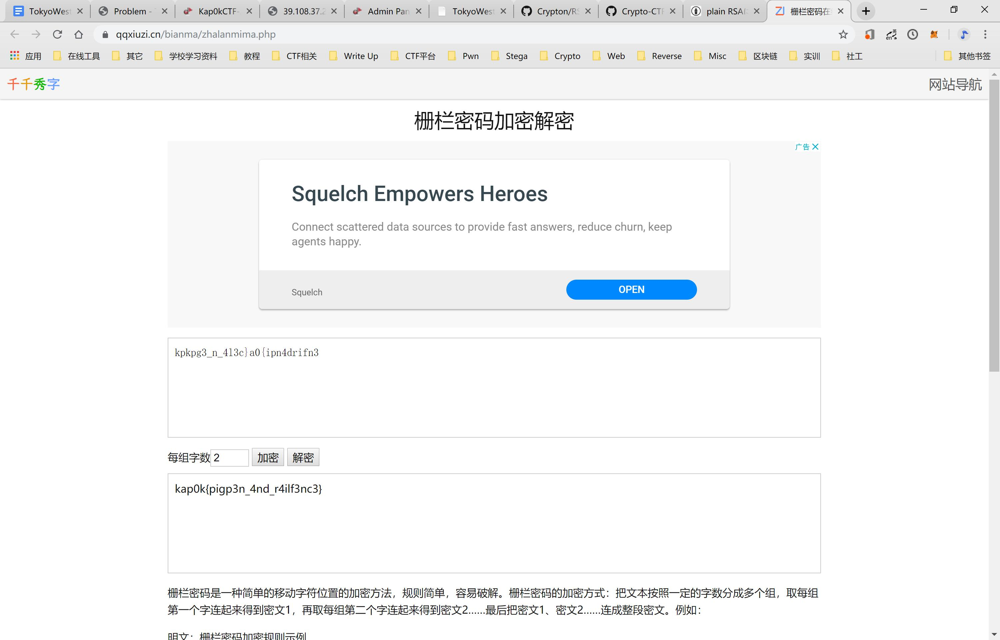
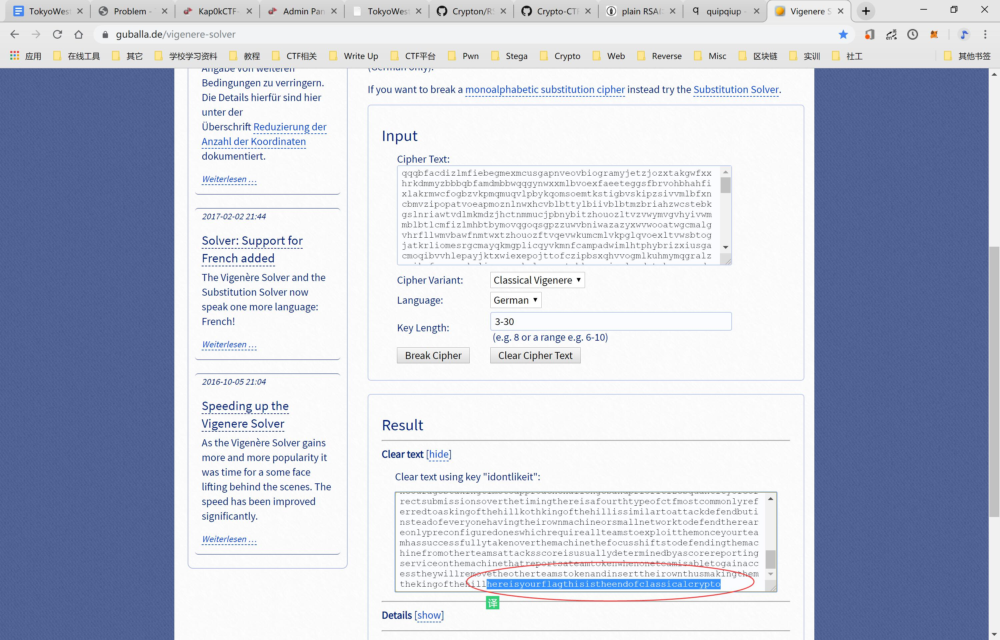

# Crypto-ASCII
题目给了一串十六进制数

> 6b6170306b7b41534349495f63306433407d

ascii解码即可


> flag:kap0k{ASCII_c0d3@}

# Crypto-Julius Caesar
题目给了一串密文

> rhw0r{j43z4y_j1wo3y_d1ao_0mmz3a_7}

根据题目信息猜测为凯撒加密，[在线解密](http://www.zjslove.com/3.decode/kaisa/index.html)即可


> flag:kap0k{c43s4r_c1ph3r_w1th_0ffs3t_7}

# Crypto-Base64
题目给了一串密文

> a2FwMGt7QjRzM182NF8xc19hX2I0c2ljX3NraTExfQ==

根据题目信息猜测为Bae64加密，[在线解密](http://ctf.ssleye.com/base64.html)即可


> flag:kap0k{B4s3_64_1s_a_b4sic_ski11}

# Crypto-社会主义核心价值观
题目给了一串密文

> 公正诚信民主公正民主法治富强和谐富强公正诚信民主法治友善平等平等和谐和谐富强公正和谐公正敬业和谐自由和谐民主公正敬业法治和谐法治自由平等诚信平等公正和谐和谐富强法治文明和谐和谐平等友善敬业法治公正和谐自由公正诚信文明法治平等和谐和谐法治和谐法治诚信和谐

根据题目信息猜测为社会主义核心价值观加密，[在线解密](https://z.duoluosb.com/)即可


> flag:kap0k{S0ci41ist_c0r3_v4lu3s}

# Crypto-PigPigPig
题目给了一张密文的图片


根据题目描述`猪冲破了猪圈`，猜测为猪圈加密，[在线解密](http://www.nicetool.net/app/pigpen_chiper_decrypt.html)得到：

> kpkpg3n4l3ca0ipn4drifn3

恢复一下`_{}`得到

> kpkpg3_n_4l3c}a0{ipn4drifn3

根据题目描述`跳过了栅栏`，猜测为栅栏加密，[在线解密](https://www.qqxiuzi.cn/bianma/zhalanmima.php)，遍历字数，当字数为2时得到flag



> flag:kap0k{pigp3n_4nd_r4ilf3nc3}

# Crypto-ROT??
题目给了一串密文

> <2A_<L}_E0#_%0`b0`D0#_%0cfN

根据题目描述`码元位置顺序替换暗码`，百度一下得到：


应该为ROT5、ROT13、ROT18、ROT47之中的一种，一个个尝试解密，当使用[ROT47](https://www.jisuan.mobi/puu3uummu313myXP.html)解密时，得到flag:


> flag:kap0k{N0t_R0T_13_1s_R0T_47}

# Crypto-You can't see this
题目给了一个task.py和output，output.txt内容如下：

> monb edcc, monb hgcn, wembmvze pvye, wembmvze pbdnb, monb lgba, monb lgcn, wembmvze rcmmh, wembmvze rdbn! d hm fgqhnb nonbufenbn, yfdrwnb wegq wen jmmqy ylenbn; gqh d ynbon wen rgdbu xvnnq, wm hnf enb mbpy vlmq wen zbnnq; wen kmfycdly wgcc enb lnqydmqnby pn; dq wendb zmch kmgwy ylmwy umv ynn; wemyn pn bvpdny, rgdbu rgomvby; dq wemyn rbnkacny cdon wendb ygomvby; d jvyw zm ynna ymjn hnfhbmly enbn, gqh egqz g lngbc dq nonbu kmfycdly ngb. enbn dy umvb rcgz: agl0a{h0_v_c0o3_kbulw0?}

task.py内容如下：

```python
import string
import random
cipher = 'You can\'t see this!!'
dic = []
keylist = string.ascii_lowercase
for i in keylist:
    dic.append(i)
for i in range(len(dic)):
    r = random.randint(0,25)
    dic[i],dic[r] = dic[r],dic[i]
output = ''
for i in cipher:
    index = ord(i)-97
    if index>=0 and index<26:
        output += dic[index]
    else:
        output += i
with open('output.txt','w') as f:
    f.write(output)
```

看样子是用随机生成的字母对应关系进行了单表加密

古典密码都有词频分析的攻击方法，所以我们可以使用字频攻击进行攻击，当然我们也可以[在线](https://quipqiup.com)破解并得到flag

PS:请点击[这里](https://ctf-wiki.github.io/ctf-wiki/crypto/classical/monoalphabetic-zh/)深入了解单表替换密码


> flag:kap0k{d0_u_l0v3_crypt0?}

# Crypto-Vigenere
题目给了一串密文

> qqqbfacdizlmfiebegmexmcusgapnveovbiogramyjetzjozxtakgwfxxhrkdmmyzbbbqbfamdmbbwqqgynwxxmlbvoexfaeeteggsfbrvohbhahfixlakrmwcfogbzvkpmqmuqvlpbykqomsoemtkstigbvskipzsivvmlbfxncbmvzipopatvoeapmoznlnwxhcvblbttylbiivblbtmzbriahzwcstebkgslnriawtvdlmkmdzjhctnmmucjpbnybitzhouozltvzvwymvgvhyivwmmblbtlcmfizlmhbtbymovqgoqsgpzzuwvbniwazazyxwvwooatwgcmalgvhrfllwmvbawfnmtwxtzhouozftvqevwkumcmlvkpglqvoexltvwsbtogjatkrliomesrgcmayqkmgplicqyvkmnfcampadwimlhtphybrizxiusgacmoqibvvhlepayjktxwiexepojttofczipbsxqhvvogmlkuhmymqgralznaikmfvnewmxkmliqrwxzxkvlrqqoatebkgswmisalpadctxkracxeqdmwgmdqumpiwmazqysatximlqgmrfnlxivpvxbzcedewninxvgcatyqcsttbhraxeeyvsmmdaftcmcgwkmgcauzbrxpxqughvnmcwqglhtrgoqxkbamlfnldqqrmwudqubymkrlhvwvrbcaegkxavwatebkgsbvjhuxzbrizmmdafflkrmvxagscxylsrohvwvrglbevmhnwvrilzdmkntdfpmqokqmmmdafflgombamuprteboqxmqqugheiuiigwsdbgpvdwneijtehxbriqkudqubymyvbxipgztjjoebmmpdgbyodsxeiqhgapqbsegnoothybriqkwsdbgpvdwutkkwaxeeysnmphabkpxbsubvhbgtebkgswmisalpkdjatzhvreomfizrghoetelojkhvwvrelzqiampdqxxckyrnxzhbpxlvnxpxvbipllemcjxzvspncqdcipiusaxdagimdbksytcoowblbxrrgekifmkahqhktbigwgbhggalznaikmfvnewmxkmlcvinewgsrdhtystxebsrotcqyahhvzmmvmrtutclgezxiqrutgqxkbhnluhkpwexphewcoraicwxtzwcsmsmciknzlhlxrccmvzlhphzrqxkxhzwgbkfasrotalrrvsixrmeiwhnvvrosxtzgmfmjtogwfxhhvmtwxwclcdzyrtvfstompiymtxviktbhubktmcsnizrpyxxaoekawikubnpmsvmilbftgibmmmgrtdnpadmwgartqbqnovmgbscvgedkpcxadbqwtnpmkntwwrlemkqatbwsziebyiikvwvrfzadtwbvwgvgepogwfxhhvmtwxwbbuhtetxmpszxfdaceppyyzljxhqhywdhqkmfhyrlbdekdmdquhepovztbksemsixeztkhhubdadctxwiunfpxvegxvfchkloowbtslbtmtuoxwtxsfbtnpmliethbtxdixhxkqrfvmthowyniqhvmjwpgwkzhqglfjwmalqrbfhgmbxpxblavgrbrizxqvoshfzdlbrxhcsvenwsamkrazhytivmymufrwewkwsbvjcsmsmrmtesrhudtvqsnmphvvewqcwqfqooemzidxivsgssxyllybbvvhrtowpidxzbcaxsifmvzbksvkzexqivplbrhcawetevhhjhcsdslxnhbqmsmbiikmrbyrazogwgnluhkplyrmlekwpacmayqkmdzympiwwbhmadyhtbdlmfwqqrrzcbxmtukoflfkmialnxzyreiuivhdhfgapukgpbvhhuxqwmyalpltglewninxvgwazepoqivplbrycwwsbamuhrtxakxbtkngfvzzomanaxoyejloxmkulbrwmgkwkhzhfrizzdmvzahfibnmyrbampopatvoxptbuschcbcebxiphbdpvglmgwqsgxluswiuthhbzlqxekvmvggapggmtezhabopbriwmphfgxlucxwdmqoawtvcizmbksvkzexxpnapoxbyodlmfbksxbyoyjbamkwyesmbiqlgrieywiqxpbalggapmxhwykoofltkkpkkgshb

根据题目描述为维吉尼亚加密，但是我们没有key。我们可以通过字频攻击进行攻击，[在线]()破解并得到flag

PS:请点击[这里](https://ctf-wiki.github.io/ctf-wiki/crypto/classical/polyalphabetic-zh/)深入了解多表替换密码



> flag:kap0k{thisistheendofclassicalcrypto}