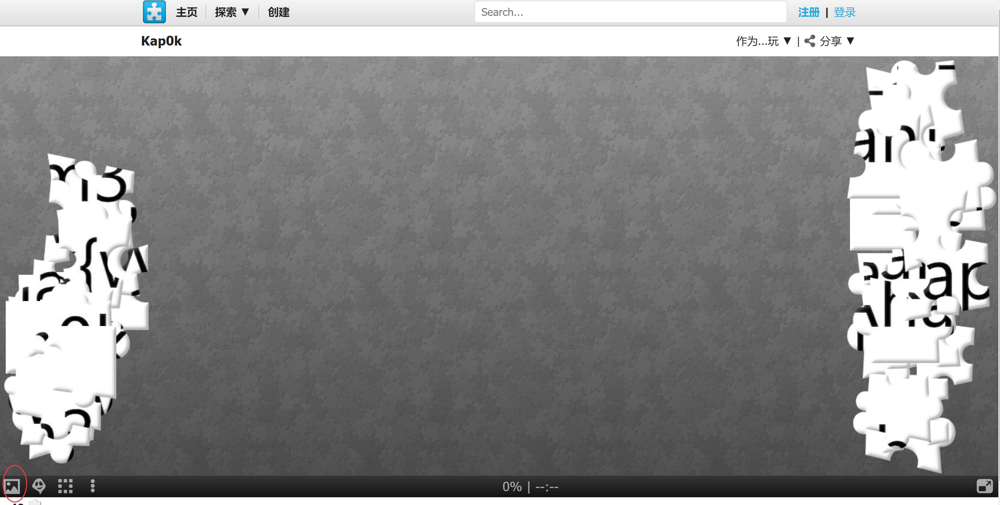
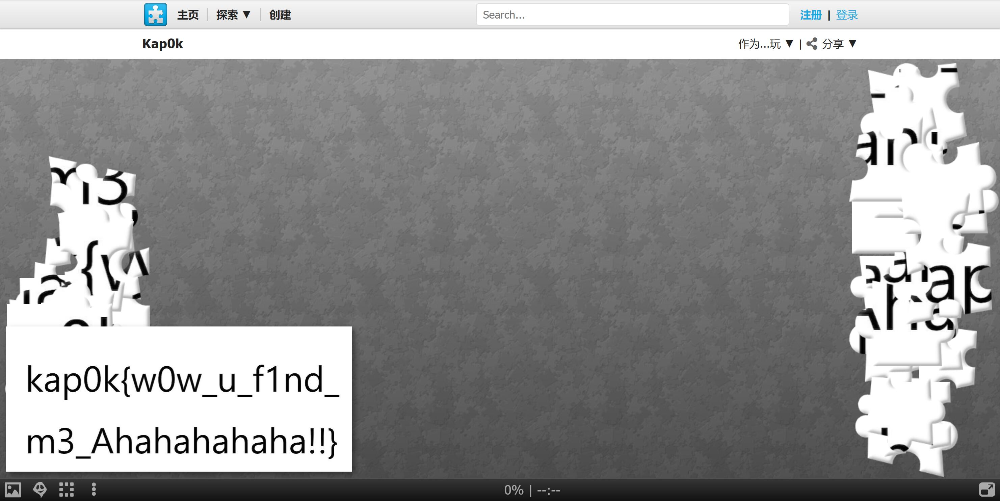
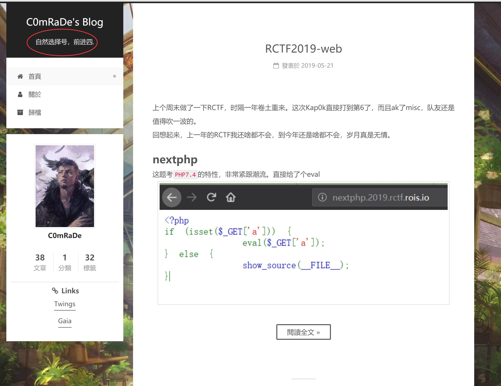
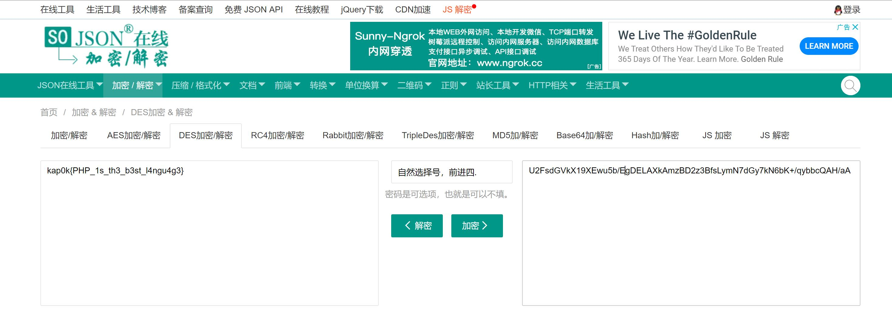
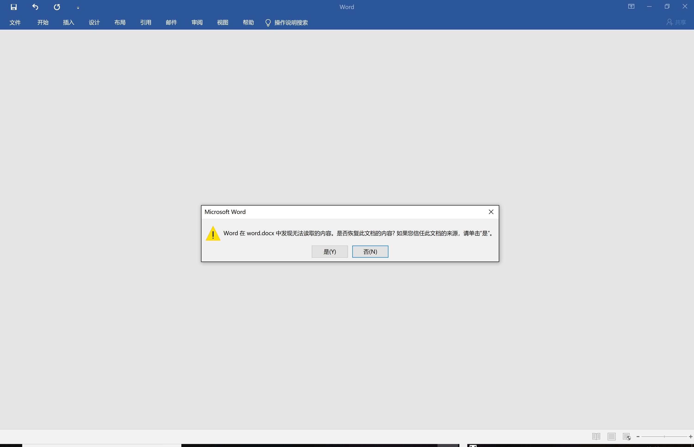
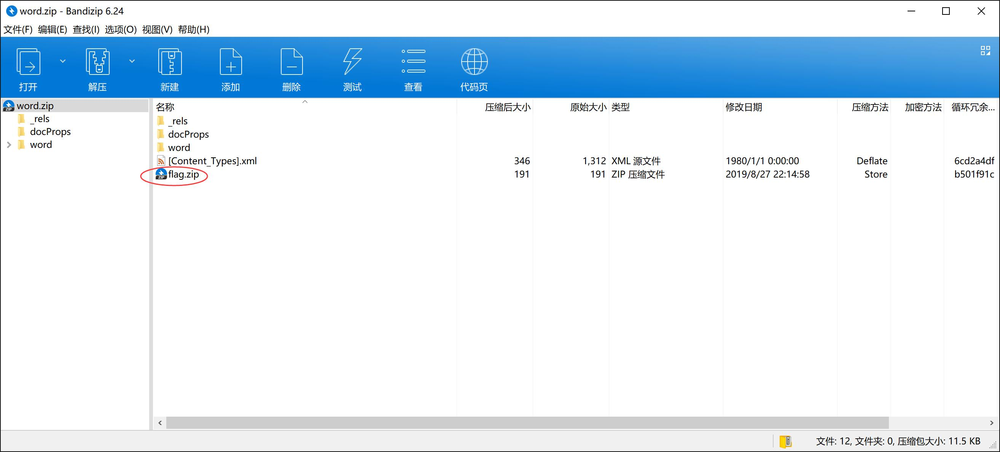
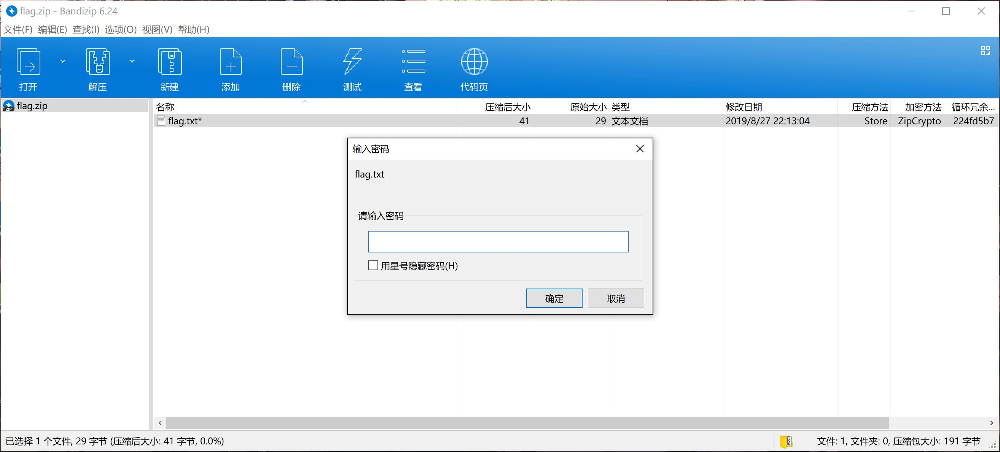
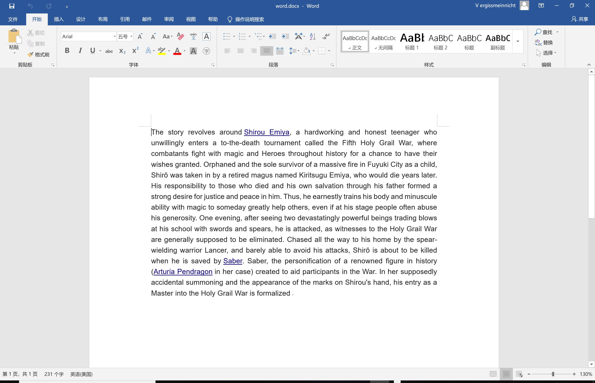
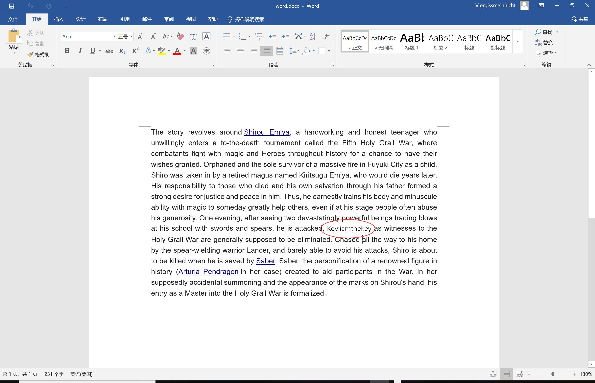
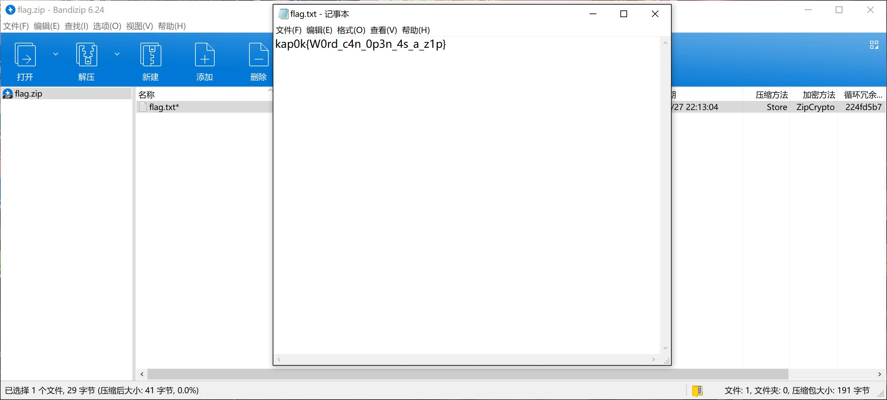

# Misc-Your best friend

点进题目，一个短链接：<http://tiny.cc/n1krbz>

有的同学发现这网页好像打不开，出大问题，这个时候你就需要一种较为科学的上网方式

比如跪在电脑前烧香再打开网页（不是

有句话说的好：Google is your best friend

打开这个网站其实题就解了，看看浏览器地址栏：

```
http://www.giybf.com/?flag=kap0k%7Bg00gle_3v3ry7h1ng%7D
```

把里面的url编码编码回来就可以了

# Misc-Puzzle

题目给了一个拼图网站，要求是拼出来flag即可。其实拼也可以，也可以直接点击左下角的按钮



然后就可以看到flag



> flag:kap0k{w0w_u_f1nd_m3_Ahahahahaha!!}

# Misc-有趣的flag
题目给了一段文本，大致就是找到QQ招新群群主的blog，上面有一句话可以解密下面的密文得到flag。

这是一道类似社工的题目，密文如下：

> U2FsdGVkX19XEwu5b/EgDELAXkAmzBD2z3BfsLymN7dGy7kN6bK+/qybbcQAH/aA

其中我给了一个`Hint:是0不是O`

是因为QQ群主叫`C0mRaDe`，但是因为QQ昵称不能打数字，所以改为了`COmRaDe`

然后我们百度或者谷歌`C0mRaDe blog`，得到blog


进去发现签名是`自然选择号，前进四.`



将这句话和密文复制到题目给的解密网站得到flag

PS：该网站解密的是OpenSSL加密的数据，OpenSSL加密的数据的前缀为`U2FsdGVkX1`，详情可看[此文](https://security.stackexchange.com/questions/124312/decrypting-binary-code-from-a-base64-string)



> flag:kap0k{PHP_1s_th3_b3st_l4ngu4g3}

# Misc-Simple Docx
题目给了一个docx文件，双击打开会有点问题



这时就要怀疑里面是不是加了点文件

其实了解docx文件格式的同学应该知道docx文件可以修改后缀名为zip打开的，打开之后发现flag.zip



提取出来发现加密了



那么我们把剩余文件再打包为zip文件，然后修改后缀为docx，打开之后一切正常



然后想一想应该是把docx中有部分文字变为了隐藏文字，可以根据[这篇文章](https://jingyan.baidu.com/article/63acb44a28737861fcc17ed4.html)操作恢复回来



得到key:`iamthekey`

最后解密zip得到flag



> flag:kap0k{W0rd_c4n_0p3n_4s_a_z1p}


# 与佛论禅

看一下密文


根据题目搜一下, 发现是一种神奇的加密, 在线解密即可


# baby_bin

没啥思路, 本来我想搞个伪加密+PNG的crc32爆破的, 但是发现伪加密用bandzip和7z可以直接暴力解出来, 于是把伪加密换成了改了分卷压缩的那个位, 后面那个PNG的crc32爆破当然你也可以不爆, 假如你发现了图片有些残缺的话, 去改一改长和宽就行了
PS: 一直提交fake_flag的大哥真的凶残

# ppap

这题一开始就是个zip明文攻击, azpr一把梭就行
然后解出来一个pyc, 尝试跑一下, 啥都没有
用pycdc反编译一下就能拿到flag了


PS: 其实这题我要背锅, 忘记了密码长度会决定爆破时间的长短, 大哥说1h多才爆出来