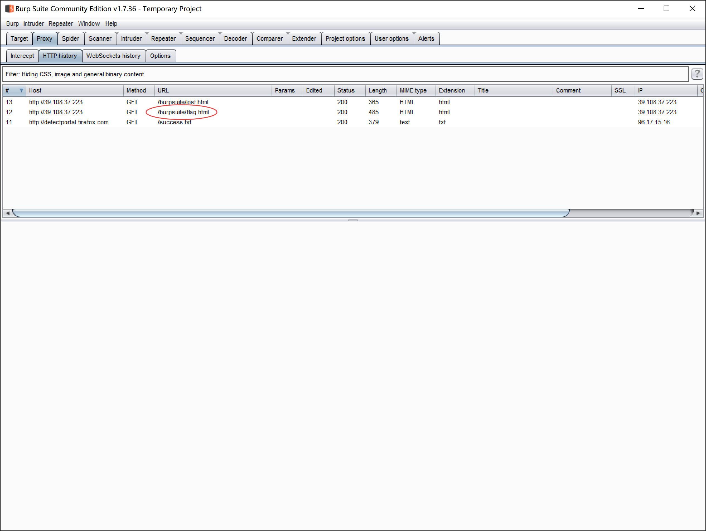
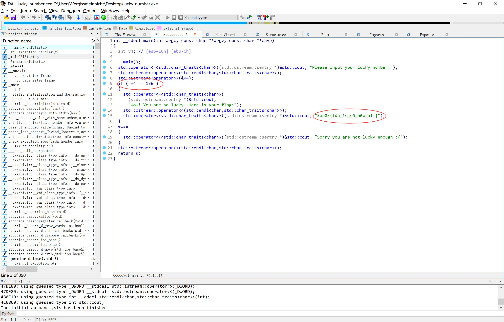

# Start-Welcome
题目让我们阅读Rule，其实阅读完了就看到flag了


> flag:kap0k{W3lc0m3_t0_th3_CTF_w0r1d!}

# Start-010Editor
题目给了一张图片


用010Editor打开拖到最后得到flag

PS：其实任何文本阅读器都可以看到，txt也可以，不过010Editor可以分析文件结构，还是挺不错的


# Start-Burp suite
题目给了一个网站


点击`Click me`之后有个东西闪过去，然后直接到了`lost.html`


我们尝试用Burp suite抓抓包



发现`flag.html`，点击得到flag


> kap0k{kn0w_u_c4n_us3_burpsu1t_R1ght?} 

# Start-Archpr
题目给了一个加密的压缩包


根据题目提示用Archpr爆破6位纯数字的密码


得到key:`491205`


用key解密压缩包得到flag


> flag:kap0k{Archpr_c4n_d0_m4ay_th1ngs}

# Start-IDA pro
题目给了一个exe文件，要求输入一个lucky number


我们用IDA pro打开


F5得到源码


可以直接输入lucky number:`136`或者直接得到flag



当然也可以shift+F12查找字符串得到flag


> flag:kap0k{ida_1s_s0_p0wful!}

# Start-Netcat
题目给了一个nc的地址，直接在ubuntu上nc过去得到flag


# Start-Stegsolve
题目给了一张图片（没错就是我的鼠标垫）


尝试用Stegsolve打开（选项字小是因为jar文件对高分辨屏幕的支持不太好，Burp suite的jar破解版同理）


根据题目中的文章使用Data Extract


得到flag


PS:在flag后面我写了`Also you can use zsteg to solve lsb stega`，你可以通过[这篇文章](https://www.helplib.com/GitHub/article_112230)下载并使用`zsteg`，效果如下：


> flag:kap0k{Stegsolve_le4d_u_t0_f1nd_secret}

# Start-Binwalk
题目给了一张图片（没错这张图是我的壁纸，P站id:20778107）


使用binwalk分析


发现隐藏了一张图片，foremost分离


得到flag


> flag:kap0k{binwalk_4nd_foremost}

# Start-Pwntools
题目给了一个task.py

```python
import os,random,sys,string
from hashlib import sha256
import SocketServer
from FLAG import flag
import signal

class Task(SocketServer.BaseRequestHandler):
    
    def recvmsg(self, sz):
        try:
            r = sz
            res = ''
            while r>0:
                res += self.request.recv(r)
                if res.endswith('\n'):
                    r = 0
                else:
                    r = sz - len(res)
            res = res.strip()
        except:
            res = ''
        return res.strip('\n')

    def dosend(self, msg):
        try:
            self.request.sendall(msg)
        except:
            pass

    def handle(self):
        random.seed(os.urandom(1))
        signal.alarm(30)
        self.dosend('Welcome to the math world!\n')
        self.dosend('If you tell me the right answer about 10 times, I will give you the flag!\n')
        self.dosend('But you only have 30s\n')
        self.dosend('Let\'s go go go!!!\n')
        count = 0
        for i in range(10):
            num1 = random.randint(65536,65536*2)
            num2 = random.randint(65536,65536*2)
            self.dosend(str(num1)+' + '+str(num2)+' = ?\n')
            self.dosend('You answer is:')
            ans = self.recvmsg(10).strip(' ')

            if (num1+num2)==int(ans):
                count +=1
                self.dosend('You win '+str(count)+' times\n')
            else:
                self.dosend('Sorry you are wrong. Please try again')
                self.request.close()
            if count==10:
                self.dosend('Wow you really did it! Here is your flag:')
                self.dosend(flag)
                self.request.close()


class ForkedServer(SocketServer.ForkingTCPServer, SocketServer.TCPServer):
    pass


if __name__ == "__main__":
    HOST, PORT = '0.0.0.0', 8000
    server = ForkedServer((HOST, PORT), Task)
    server.allow_reuse_address = True
    server.serve_forever()
```

大概的意思就是题目会给你10组数字，范围在(65536,65536*2)，你要返回它们的和，成功10次便可获得flag

需要注意的是`signal.alarm(30)`限制了10次操作要在30s内完成，所以我们需要脚本进行辅助

学习完了pwntools的同学应该就会做了，下面是exp

exp.py
```python
from pwn import *
context.log_level = 'debug'
HOST = "39.108.37.223"
PORT = 8000

r = remote(HOST, PORT) 

sl = lambda s : r.sendline(s)
rl = lambda  : r.recvline()
sd = lambda s : r.send(s)
rc = lambda n=4096 : r.recv(n)
ru = lambda s : r.recvuntil(s)

ru('Let\'s go go go!!!\n')
for _ in range(10):
    expr = ru(' =')[:-2]
    res = eval(expr)
    ru('You answer is:')
    sl(str(res))
    ru('times\n')
ru('Wow you really did it! Here is your flag:')
flag = ru('}')
log.success(flag)
r.close()
```

exp运行结果


> flag:kap0k{pwnt00ls_c4n_s3nd_4nd_r3c3iv3_f4lg}


# Start-Hackbar


打开看到一行文字, 提示用post传值, 打开hackbar


即可看到flag

同时我们可以看到hackbar还有些其他功能, 比如你可以勾选其他三个选项, 对请求包的其他值进行更改


上面的几种encoding也比较实用


当然用多了你会更喜欢burp---


在repeater中右键`change requests method`, 然后添加post内容即可


# Start-try to use Docker

题目中给了一份文档

[docker从入门到实践](https://yeasy.gitbooks.io/docker_practice/content/install/ubuntu.html)

我们先根据文档中的内容安装docker

命令我就不重复打了, 文档中讲的挺好的

安装完后测试一下

```
$ docker -v
```


题目中给了两个文件, 一个是启动脚本, 一个是Dockerfile, 我们先build 一下

```
$ docker build -t try .
```


build完成后直接运行

```
$ docker run try
```


可以直接看到flag, 这道题的本意是让大家搭建完docker后根据docker容器的版本来判断是否搭建成功, 只是没有想到他看到的是宿主机的版本, 如果我们缘分到了刚好版本一致的话就可以getflag了, 但是看起来大家似乎与我无缘hhh

参考这篇文章https://blog.csdn.net/c461522756/article/details/70822234

我原来用的是

```
cat /proc/version
```

实际上我们应该用

```
cat /etc/issue
```

后来我把服务端的代码改了, 相当于只要运行start.sh就可以看到flag了, 再次抱歉

docker之所以重要的原因是现在很多题目都会以docker的形式部署, 一般会给`Dockerfile`或者`docker-compose.yml`来构建并启动docker, 包括我们平台上的题目也是基于docker部署的, 当你想上网找题来做或者自己出题的时候

**docker is your best friend**

下面是删除镜像, 我们可以先用

```
$ docker container ls -a
```

来查看所有的docker container, 如果不加`-a`的话, 只能看到运行中的docker container


如果是up的话, 可以使用

```
$ docker stop 1d8c
```

来停止docker, 这里的1d8c是docker container ID的前几位, 在不重复的情况下, docker允许我们使用这样的方式来指定container 或者 image

删除的命令如下

```
$ docker container rm 1d8c
```

如果要删除镜像的话, 可以使用

```
$ docker image rm try
```


